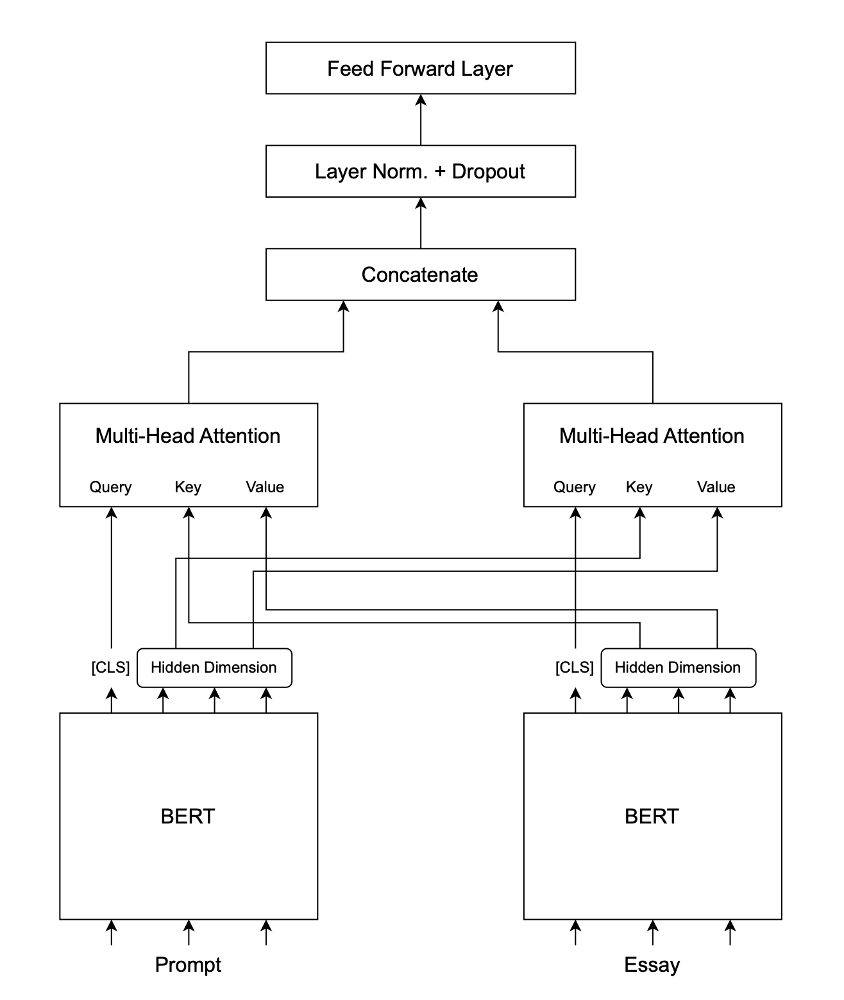

# Project: Automated IELTS Essay Evaluation and Categorization

## Table of Contents
1.  [Introduction](#introduction)
2.  [Motivation](#motivation)
3.  [Dataset](#dataset)
4.  [Methodology](#methodology)
    * [Overall Workflow](#overall-workflow)
    * [Machine Learning Models](#machine-learning-models)
    * [Statistical Analyses](#statistical-analyses)
5.  [Project Structure](#project-structure)
6.  [Notebooks Overview and Links](#notebooks-overview-and-links)
7. [Dual Bert Encoder Architecture Diagram](#dual-bert-encoder-architecture-diagram)

## Introduction
This project, developed as part of our NLP module, focuses on the automatic evaluation of essays written for IELTS (International English Language Testing System) Writing Tasks. The primary goals are to predict essay scores across various criteria and to categorize essays based on their respective prompts.

## Motivation
* **Core Objective:** We aim to develop a system that can automatically score IELTS essays and assign them to categories based on the essay prompt.
* **Driving Force:** Our motivation is to provide students preparing for the IELTS test with a tool to get preliminary feedback on their essays, helping them identify areas for improvement.
* **Key Questions:** We seek to answer: "How good is my essay?" and "Does my essay align with others that address the same prompt?"

## Dataset
We are utilizing a pre-existing dataset from HuggingFace: [IELTS Writing Task 2 Evaluation](https://huggingface.co/datasets/chillies/IELTS-writing-task-2-evaluation). For each essay prompt, the dataset provides the corresponding essay response.
The evaluation scores are broken down into:
* Task Achievement
* Coherence and Cohesion
* Lexical Resource
* Grammatical Range and Accuracy

These individual scores contribute to an **Overall Band Score**.

## Methodology

### Overall Workflow
Our project approach is structured as follows:
1.  **Data Cleaning:** Preprocessing the raw essay data.
2.  **Statistical Analysis:** Performing exploratory data analysis to gain insights into the dataset.
3.  **Baseline Model Training:** Training conventional machine learning models to establish benchmark performance.
4.  **BERT Model Training:** Fine-tuning BERT-based transformer models for essay scoring.
5.  **Clustering Implementation:** Developing clustering mechanisms to group similar essays.

### Machine Learning Models
Everything is runnable with Python Version 3.10.

To install the requirements run: ```pip install -r requirements.txt```

We plan to train the following types of models:

* **For Automated Essay Scoring (AES):**
    * **Conventional Models (Baselines):** Linear Regression, Logistic Regression, Support Vector Machines (SVM), K-Nearest Neighbor (KNN).
    * **Transformer-based Models:** BERT, EuroBERT (for regression or classification tasks on scores).
* **For Essay Clustering:**
    * K-Means Clustering
    * Hierarchical Clustering

### Statistical Analysis
To uncover initial insights and correlations within the data, we intend to perform the following statistical analysis:
1.  Investigate the correlation between **text length** and **band score**.
2.  Analyze the influence of **word diversity** on the evaluation criteria.
3.  Determine the **vocabulary distribution** for each essay prompt.
4.  Examine if there are differences in the **demands on the writer** across the sub-score categories (Task Achievement, Coherence, Lexical Resource, Grammar).
5.  Compare the perceived **difficulty** of different essay prompts.
6.  Explore the correlation between **specific words/phrases** and the **Overall Band Score**.

## Notebooks Overview and Links

This section provides direct links to the Jupyter notebooks used in this project.

### 1. Data Processing and Exploration
* [**Data Cleaning** ](./notebooks/data_cleaning.ipynb) - Initial data loading, cleaning, and preprocessing.
* [**Data Exploration** ](./notebooks/data_exploration.ipynb) - General exploration of the dataset features.
* [**Prompt Binning/Categorization** ](./notebooks/prompt_binning.ipynb) - Analysis and grouping of essay prompts.

### 2. Statistical Analysis
These notebooks correspond to the statistical analyses outlined in the methodology:
* [**Analysis 1 (Length vs. Score)** ](./notebooks/statistical_analysis_1.ipynb) 
* [**Analysis 2 (Word Diversity vs. Criteria)** ](./notebooks/statistical_analysis_2.ipynb) 
* [**Analysis 3 (Vocabulary per Prompt)** ](./notebooks/statistical_analysis_3.ipynb) 
* [**Analysis 4 (Sub-score Demands)** ](./notebooks/statistical_analysis_4.ipynb) 
* [**Analysis 5 (Prompt Difficulty)** ](./notebooks/statistical_analysis_5.ipynb) 
* [**Analysis 6 (Specific Words vs. Score)** ](./notebooks/statistical_analysis_6.ipynb) 

### 3. Model Training and Evaluation
* [**Linear Regression** ](./notebooks/linear_regression.ipynb) - Baseline regression model
* [**Logistic Regression** ](./notebooks/logistic_regression.ipynb) - Baseline classification model
* [**Support Vector Machines (SVM)** ](./notebooks/svm.ipynb) - Baseline classification model
* [**K-Nearest Neighbors (KNN)** ](./notebooks/knn.ipynb) - Baseline classification model
* [**BERT** ](./notebooks/bert.ipynb) - Multiple BERT model architectures 
* [**EuroBERT** ](./notebooks/euro_bert.ipynb) - BERT Model with larger context window
* [**K Means Clustering** ](./notebooks/k_means_cluster_essays.ipynb) - Clustering of the essays and comparison to the clustered prompts

## Performance

| Model | Training Type | Method/Configuration | Accuracy |
|--------|---------------|---------------------|----------|
| Linear Regression | Regression | - | 53.30% |
| Logistic Regression | Classification | - | 59.91% |
| SVM | Classification | - | 59.47% |
| KNN | Classification | - | 64.0% |
| Basic BERT | Classification | Pooling hidden states | 27.75% |
| Basic BERT | Classification | CLS token | 32.60% |
| Basic BERT | Regression | CLS token | 57.50% |
| Twin BERT Encoder | Regression | CLS token appended | 61.23% |
| Twin BERT Encoder | Regression | Cross-attention | 80.83% |
| EuroBert | Regression | - | 53.0% |

## Dual Bert Encoder Architecture Diagram


